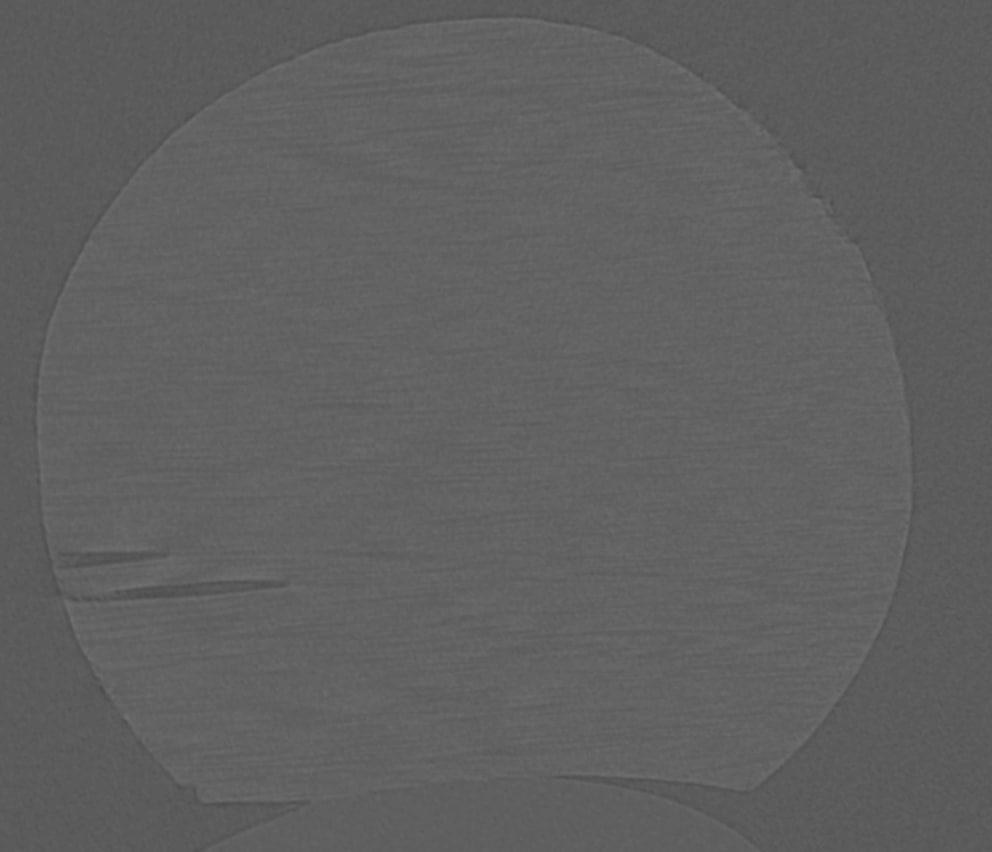
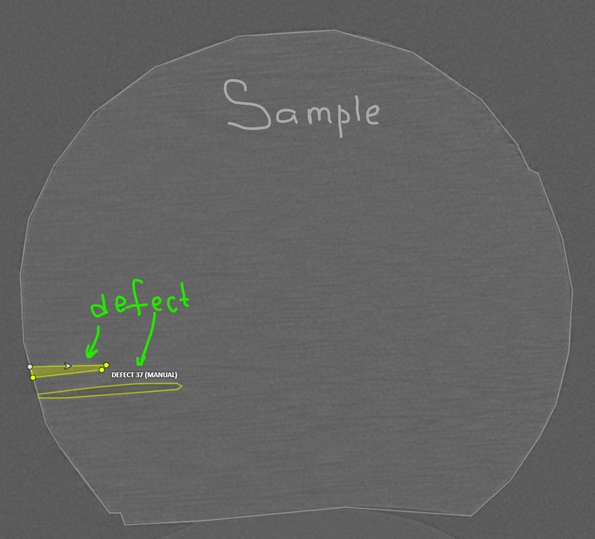
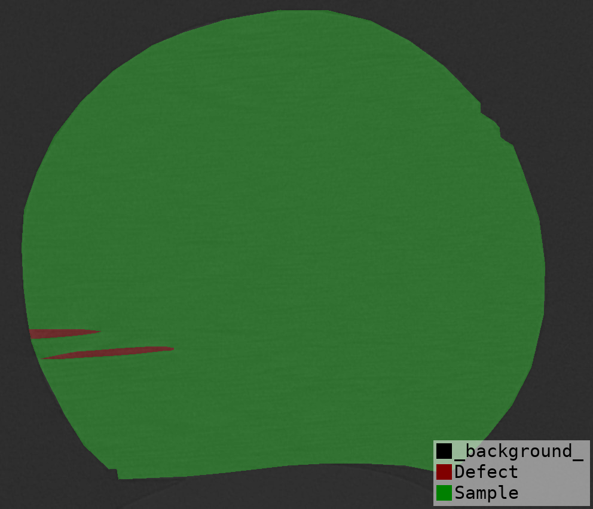
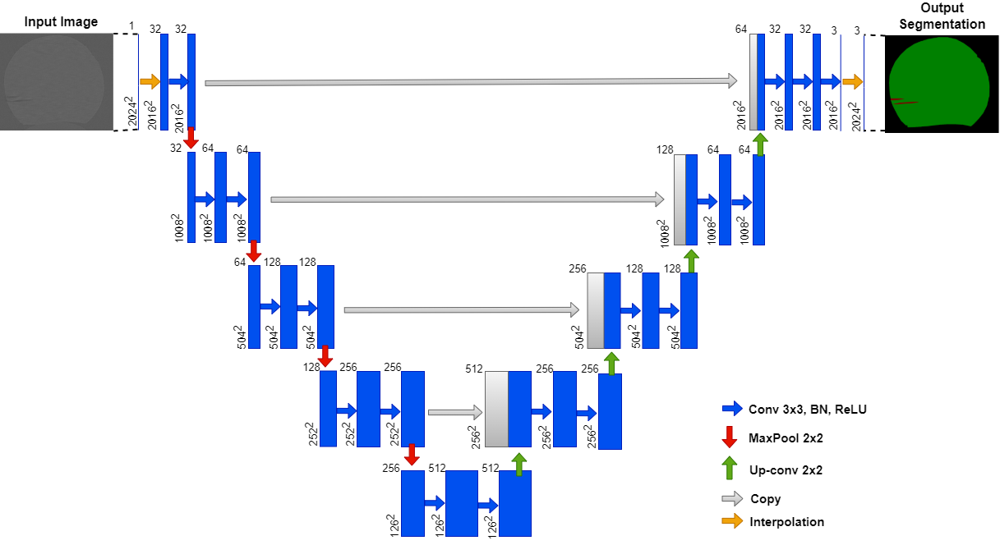

# ADH: Composite Vision

Applied Data Hackathon 2022.

Composite Vision team project on segmenting defects in CT scans of composite material parts.

# Problem

When manufacturing [Carbon fiber reinforced polymers](https://en.wikipedia.org/wiki/Carbon-fiber-reinforced_polymers),
structural defects such as delaminations can occur inside material.
These defects can impair composite physical properties and even render a detail unacceptably defective.
Non-destructing testing is a procedure that can be used to identify these defects by means of computed tomography imaging,
ultrasound imaging or other techniques.

# Goal

In this project, we are working on a computer vision model capable of segmenting defects in CT images of a CFRP composite.

# Data

The data consists of CT images of several composite parts:

* 200 sample grayscale PNG images with annotations in VOC polygon format.
  [Link](https://disk.yandex.ru/d/9WPI8wIcv91VtA) to Yandex disk (24 Mb)

Image:

Annotations:

Segmentation map:

U-Net model:

# Tasks

Here're several tasks that we should assign to the team members.

1. Research available public datasets (Google Dataset Search, Zenodo, Kaggle)
1. Annotate a portion of raw images in accordance to the sample dataset annotation. [LabelMe](https://pypi.org/project/labelme/) is a nice tool to quickly start the work.
   - Each of team members annotates up to 200 images.
   - David: [individual0.zip](https://disk.yandex.ru/d/AiAjtTmxuOUZKQ)
   - Tony: [individual1.zip](https://disk.yandex.ru/d/e-ShqQleCDGwxw)
   - Mile: [individual2.zip](https://disk.yandex.ru/d/6FCQ8F_yOpef0Q)
   - Ivan: [individual3.zip](https://disk.yandex.ru/d/DoKPkHRFmNJnDw)
3. Test hypotheses:
   - Classical computer vision with scikit-image / OpenCV can segment the defects.
   - Train and evaluate UNet. You can use [Pytorch Segmentation Models](https://github.com/qubvel/segmentation_models.pytorch) for quick start.
4. Prepare training and evaluation splits.
5. Make a final presentation. (**Ruslan**)

# Tools and resources

For image labeling we'll be using [LabelMe](https://pypi.org/project/labelme/).

For model prototyping -- Pytorch and torchvision.

If you need a GPU machine, ask Ivan or use Google Colab.

# Timeline

## Friday 04/03/2022

* Had a meeting, discussed tasks.
* Prepared data splits for individual labeling.

## Saturday 05/03/2022

* Discussed annotation process with labelme
* Uploaded data to/from s3 (Tony)

## Sunday 06/03/2022

* Data annotation completed (200 total)
* Dataset and model code
* Trained a UNet, recorded artifacts

## Monday 07/03/2022
